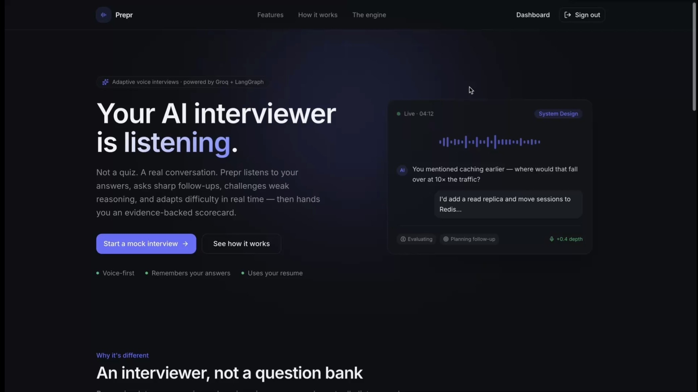

<div align="center">

# Prepr — AI Mock Interview Platform

**A live, voice-first AI interviewer that listens, asks sharp follow-ups, adapts difficulty in real time, and returns an evidence-backed scorecard.**

Not a chatbot. Not a question bank. A reasoning engine that evaluates before it speaks.

<sub>Hosted on a free instance that sleeps when idle — the first load can take ~30–60s to wake. Everything after is instant.</sub>

<br/>


</div>

---

## Demo

Watch the full demo of the **Prepr** in action.

<p align="center">
  <a href="https://vimeo.com/1206815065?share=copy&fl=sv&fe=ci">
    
  </a>
</p>

<p align="center">
  <strong>▶ Click the image above to watch the full demo on Vimeo.</strong>
</p>

---

## Overview

Prepr is a full-stack, production-grade platform that runs realistic technical
interviews by voice. You speak your answers; it transcribes them, reasons about
their quality, decides what to ask next, and speaks the next question back —
then delivers a detailed report where every score is justified by direct quotes
from what you actually said.

It's built end-to-end in **TypeScript**: a Next.js App Router frontend and API,
a **LangGraph** multi-agent reasoning engine over **Groq**, **PostgreSQL +
pgvector** for data and semantic resume recall, local **BAAI/bge-small-en-v1.5**
embeddings, and **Deepgram** (speech-to-text) + **Cartesia** (text-to-speech)
with automatic browser fallbacks. No OpenAI, no Anthropic, no paid embedding APIs.

## Features

- **Voice-first live interview** — speak naturally; streaming speech-to-text and low-latency text-to-speech make it feel like a real call, with the interviewer's reply synthesized sentence-by-sentence as it's generated.
- **Reason-before-speaking engine** — every answer runs through four cooperating agents (evaluate → plan → speak) so each follow-up is contingent on what you actually said, never a random next question.
- **Adaptive difficulty** — when you're strong it digs into trade-offs and edge cases; when you struggle it eases off with hints, adjusting in real time.
- **Genuine memory** — remembers claims you made earlier, references them later, and never repeats a question.
- **Resume-aware** — upload a PDF, DOCX, or TXT; it's parsed, structured by the LLM, embedded into pgvector, and woven into questions through semantic search.
- **Evidence-based reports** — an overall score plus five dimensions (technical, communication, confidence, problem-solving, behavior), each backed by verbatim quotes, with strengths, weaknesses, recommendations, and learning resources.
- **Analytics dashboard** — radar skill profile, score progression over time, most-improved and weakest skills, and topic coverage across all your interviews.
- **Four interview tracks** — Software, Frontend, Data, and Site Reliability Engineer, each with its own topic set and Easy / Medium / Hard difficulty presets.
- **Shareable reports** — export to PDF and generate revocable public links that render read-only without login.
- **Secure by design** — JWT auth (bcrypt-hashed passwords, edge-verified sessions); provider API keys never reach the browser.
- **Graceful degradation** — with no paid API keys, the app still runs on browser speech engines and deterministic scoring.

## How it works

Each candidate answer is processed by a **LangGraph** state machine of four
agents that run in a fixed order — the interviewer speaks **last**, and only
after the answer has been scored and a plan chosen:

```
memory  →  evaluator  →  planner  →  interviewer
(recall)   (scores,      (decides    (speaks — only
            never talks)  what's      after the first
                           next)       three have run)
```

- **Memory** loads conversation history, resume context, and covered topics.
- **Evaluator** scores the last answer against a fixed rubric and extracts evidence quotes. It never generates interviewer dialogue.
- **Planner** turns those scores into a decision — `continue | follow_up | challenge | move_topic | end` — plus a difficulty delta, with deterministic guardrails so the LLM can't wander off-script.
- **Interviewer** speaks the next question using the plan as its instruction. It never scores.

Everything said or scored is persisted turn-by-turn, so the final report is
assembled from durable, cited evidence rather than an unexplained number.

```
                       ┌──────────────────────────────────────────────┐
   Browser (client)    │              Next.js (App Router)             │
 ┌──────────────────┐  │                                              │
 │ Live Interview UI │──┼─▶ API Routes ─▶ Service layer ─────────────┐ │
 │ mic · wave · TTS  │◀─┼──  (nodejs)      auth/resume/interview/...  │ │
 └───────┬──────────┘  │        │ edge                               │ │
   STT   │  ▲ TTS       │   ┌────┴─────┐         ┌────────────────────▼┐│
 ┌───────▼──┴────────┐  │   │  proxy   │         │  Interview Engine    ││
 │ Deepgram · Cartesia│  │   │ JWT/jose │         │  (LangGraph.js)      ││
 │  + browser fallbk  │  │   └──────────┘         │ memory→evaluator→    ││
 └───────────────────┘  │                         │ planner→interviewer  ││
                        │   ┌──────────┐  ┌────────┴──────────┐          ││
                        │   │ Groq LLM │  │ Prisma + pgvector │◀─────────┘│
                        │   │fastembed │  │ PostgreSQL        │           │
                        │   └──────────┘  └───────────────────┘           │
                        └──────────────────────────────────────────────┘
```

Deeper write-ups: [`docs/ARCHITECTURE.md`](docs/ARCHITECTURE.md) ·
[`docs/FOLDER_STRUCTURE.md`](docs/FOLDER_STRUCTURE.md)

## Engineering highlights

| Decision | Why it matters |
| --- | --- |
| **One TypeScript runtime** — LangGraph.js + `fastembed` instead of a Python sidecar | The brief mandates LangGraph and local `bge-small-en-v1.5` embeddings (both Python-first) *and* "TypeScript everywhere." `fastembed`'s default model *is* bge-small, so the whole stack stays one language, one process, one deploy — no network hop in the voice loop. |
| **Reason-before-speak agent ordering** | Evaluator and interviewer are separate nodes, so "score before you talk" is a structural guarantee, not a prompting convention. |
| **Quality / fast model split** | The interviewer and report use Groq's 70B model; the per-turn evaluator and planner use the 8B model — accuracy where it counts, latency where it's felt. |
| **Provider adapters with fallbacks** | Deepgram/Cartesia sit behind interfaces that fall back to browser speech APIs, and keys stay server-side (short-lived STT tokens, proxied TTS audio). |
| **Live state as a JSON snapshot** | `Interview.state` lets a refresh or reconnect resume exactly where it left off in one read, while turns, evaluations, and reports are fully normalized once persisted. |
| **Clean layering** | `app → services → agents → lib`, dependencies point inward, and no business logic lives in UI components — the engine and services know nothing about HTTP or React. |
| **Persistent server over serverless** | A long-lived Node process loads the native embedding runtime once and keeps semantic resume search working, with no per-request bundling limits. |

## Tech stack

| Layer          | Choice                                                            |
| -------------- | ---------------------------------------------------------------- |
| Frontend       | Next.js 16 (App Router), React 19, TypeScript, Tailwind v4, shadcn/ui, Framer Motion, Recharts |
| Backend / API  | Next.js Route Handlers (Node runtime), clean service layer       |
| Reasoning engine | LangGraph.js (`@langchain/langgraph`) StateGraph               |
| LLM            | Groq (`llama-3.3-70b-versatile` quality · `llama-3.1-8b-instant` fast) |
| Embeddings     | `fastembed` → **BAAI/bge-small-en-v1.5** (384-dim), local, no key |
| Speech-to-text | Deepgram streaming → browser `SpeechRecognition` fallback         |
| Text-to-speech | Cartesia (`sonic-2`) → browser `speechSynthesis` fallback        |
| Database       | PostgreSQL 16 + **pgvector**, Prisma ORM                         |
| Auth           | JWT via `jose` (edge-safe), bcrypt (`bcryptjs`), Zod validation  |
| Hosting        | Render (persistent web service) + Neon (serverless Postgres)     |

## The core loop, end to end

The real API sequence for one interview turn (trimmed for readability).

**1 · Start an interview** — the planner opens on a warm-up topic; the interviewer produces the question:

```json
POST /api/interview/start   { "type": "FRONTEND_ENGINEER", "difficultyPreset": 3 }

{ "data": {
    "interviewId": "cmr43y0gb0002shgtcv7c9a8n",
    "question": "Hi, it's great to have you on the call... Can you tell me about a recent or favorite project where you used JavaScript?",
    "topic": "JavaScript" } }
```

**2 · The candidate answers** — memory → evaluator → planner → interviewer runs behind this single call, producing a follow-up contingent on the specific technique mentioned:

```json
POST /api/interview/turn
{ "interviewId": "cmr43y...", "transcript": "I built a React dashboard using hooks and context for state management, with a focus on performance via memoization." }

{ "data": {
    "question": "That's a great approach to performance optimization. How did you determine which components or functions to prioritize for memoization in your React dashboard?",
    "topic": "JavaScript", "difficulty": 3, "questionCount": 2, "maxQuestions": 10 } }
```

**3 · End and pull the report** — assembled from the persisted transcript, every score backed by a stored quote:

```json
GET /api/report/cmr43y...

{ "overallScore": 8.1, "technicalScore": 8, "communicationScore": 9,
  "confidenceScore": 8, "problemSolvingScore": 7, "behaviorScore": 9,
  "strengths": [ "Provided a concrete example — a React dashboard", "Demonstrated state-management knowledge (hooks, context)" ],
  "evidence": [ { "dimension": "Technical", "score": 8,
      "quotes": [ "I built a React dashboard using hooks and context for state management, with a focus on performance via memoization." ] } ] }
```

On the client, [`useVoiceInterview`](src/hooks/useVoiceInterview.ts) drives the
same loop: mic capture → STT → `/api/interview/turn` → the returned question is
streamed to TTS while a waveform and silence-detector auto-submit the next
answer once you stop talking.

## Project structure

```
src/
├── app/
│   ├── (marketing)/      landing page
│   ├── (auth)/           login · signup
│   ├── (app)/            dashboard · resume · interview · report · history · profile
│   └── api/              auth · resume · interview · report · history · profile · voice
├── components/           ui (shadcn) · landing · auth · app · dashboard · interview · report · resume
├── services/             auth · resume · interview · report · analytics   (business logic)
├── agents/               graph · state · schemas · context · prompts · nodes/  (LangGraph)
├── lib/                  env · db · http · auth/ · llm/ · embeddings/ · voice/ · resume/
├── hooks/                useVoiceInterview · useSpeechToText · useTextToSpeech · useAuth
├── types/                shared domain types
├── utils/                pure helpers (format · score)
└── proxy.ts              edge JWT guard for protected routes
```

## Getting started

**Prerequisites:** Node 20+, Docker.

```bash
cp .env.example .env          # 1. add a JWT_SECRET (and GROQ_API_KEY for AI)
npm install                   # 2. install deps (also generates the Prisma client)
npm run db:up                 # 3. start PostgreSQL + pgvector (Docker)
npm run db:push               # 4. create the schema
npm run dev                   # 5. http://localhost:3000
```

Optional demo account: `npm run db:seed` → `demo@prepr.dev` / `demo1234`.

Without `GROQ_API_KEY`, auth, resume upload, and database flows all work and
voice uses the browser engines; the interviewer's questions and reports need
Groq (free tier).

## Environment variables

Copy `.env.example` to `.env`. Only the first group is required; the AI/voice
keys are optional and the app degrades gracefully without them.

| Variable | Required | Notes |
| -------- | -------- | ----- |
| `JWT_SECRET` | Required | ≥16 characters. Generate with `openssl rand -base64 48` |
| `DATABASE_URL` | Required | Postgres connection (pooled, in production) |
| `DIRECT_URL` | Prod | Direct (non-pooled) connection for Prisma Migrate; same as `DATABASE_URL` locally |
| `GROQ_API_KEY` | Optional | [console.groq.com](https://console.groq.com) — enables the interviewer / evaluator / reports |
| `DEEPGRAM_API_KEY` | Optional | Streaming STT; falls back to browser if unset |
| `CARTESIA_API_KEY` / `CARTESIA_VOICE_ID` | Optional | TTS; falls back to browser if unset |
| `EMBEDDING_CACHE_DIR` | Optional | Where bge-small downloads (~90MB, once) |

Provider keys never reach the browser: Deepgram uses a short-lived token
(`/api/voice/token`) and Cartesia audio is proxied through `/api/voice/tts`.

## Deployment

The app runs as a **persistent Node server** (`next start`) so the native
embedding runtime loads once and semantic resume search stays fully functional.
It's deployed on [Render](https://render.com) (see [`render.yaml`](render.yaml))
with a [Neon](https://neon.tech) Postgres database (pgvector enabled).

- **App** — any Node host. Build `npm install --include=dev && npm run build`, start `npm run start`.
- **Database** — any managed Postgres with the `vector` extension. Point `DATABASE_URL` at the pooled connection and `DIRECT_URL` at the direct one, then run `prisma migrate deploy`.

---

<div align="center"><sub>Built with TypeScript, LangGraph, and a lot of attention to the voice loop.</sub></div>
